# Cheat Sheet
#### Her bir kolonu en büyük değerlerini kolayca incelemek için
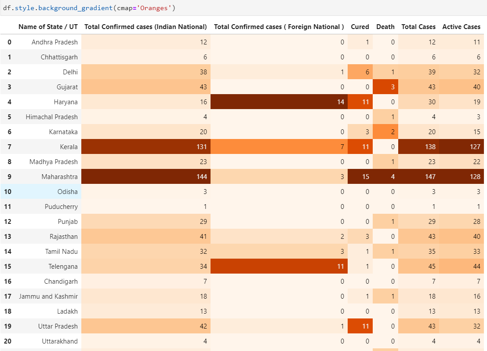

####  Grupladıktan sonra toplamlara göre büyükten küçüğe sıralama
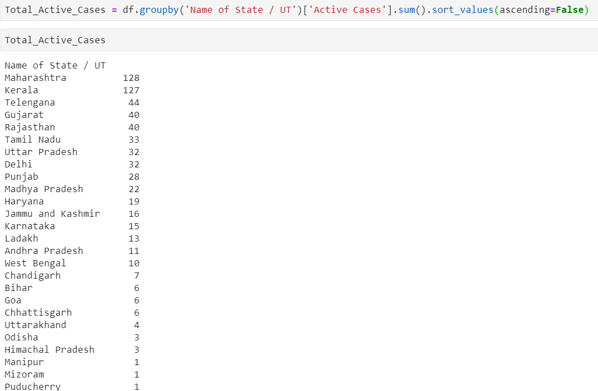

#### Görüntünün daha iyi olması için sona to_frame() ekleyip dataframe olarak daha iyi görebiliriz.
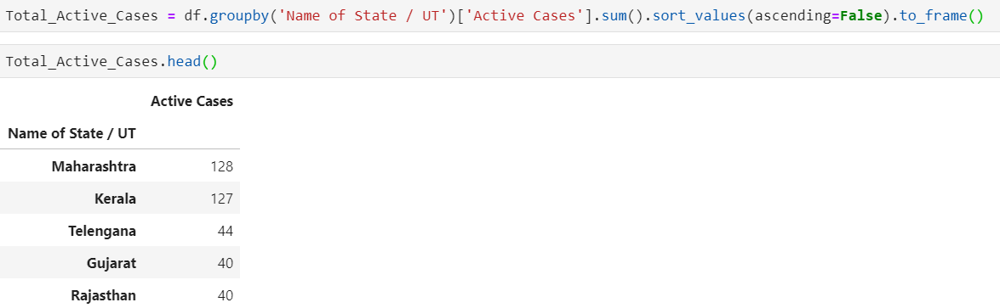

#### Plotların figure boyutlarını bir defa verip devamlı olarak tekrar yazmamak için aşağıdaki komutu girmek yeterlidir.
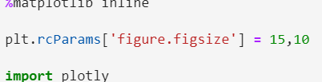

#### Plotly da aynı pandas dataframe görselleştirilir gibi görselleştirilir sadece başına **i** eki gelir
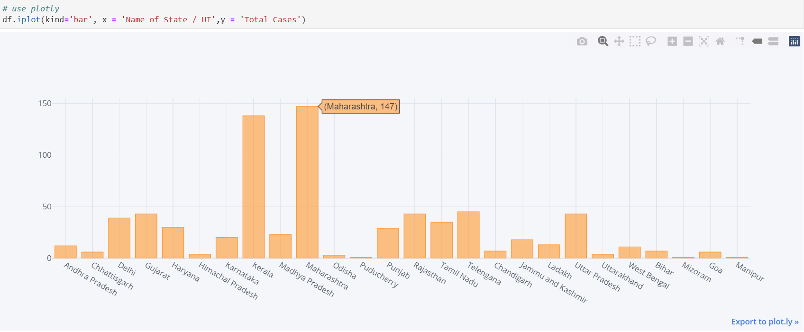

#### Plotly express ile de efektif plotlar uluşturulabilir
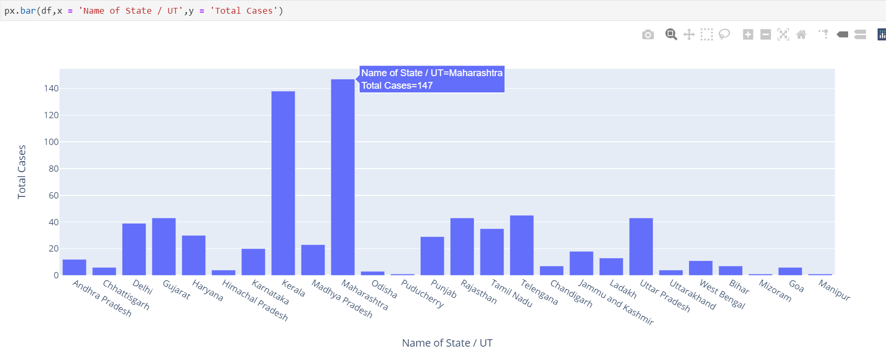

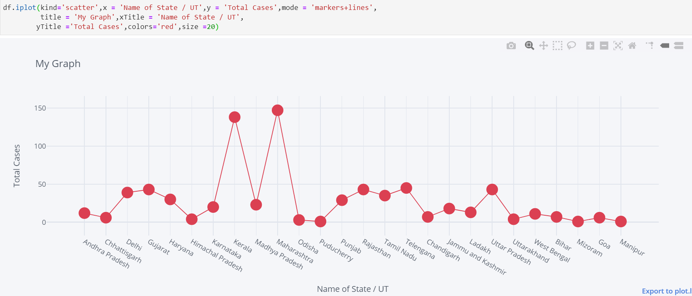

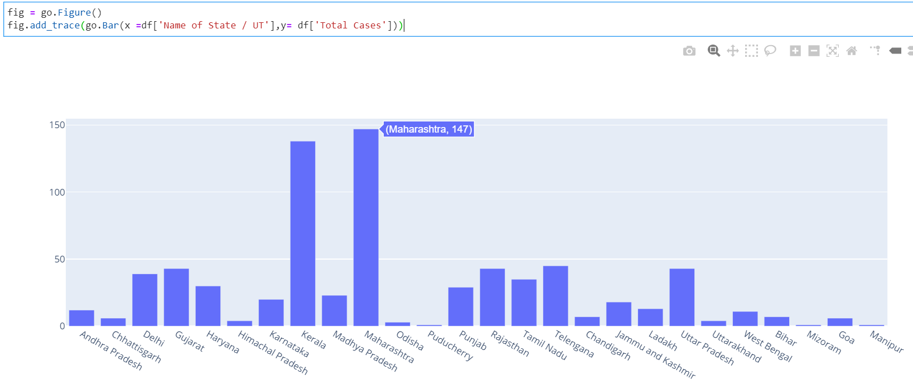


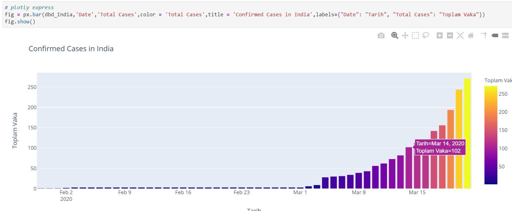

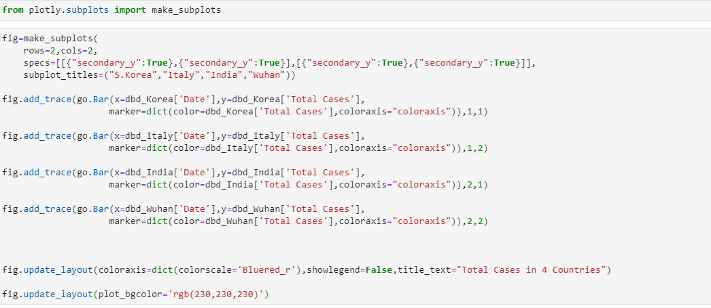

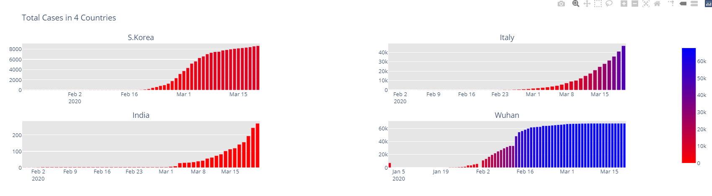

#### Kolon ismini Değiştirme

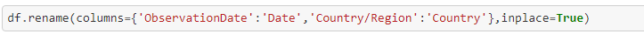

### Nümerik ve Kategorik Kolonları Ayırma

```python
categorical_features = []
numerical_features = []

for column in data.columns:
    dtype = str(data[column].dtype)
    if dtype in ["float64", "int64"]:
        numerical_features.append(column)
    else:
        categorical_features.append(column)
```

### Boş olanları Doldurma ve LabelEncoding Yapma

```python
for categorical_feature in categorical_features:
    data[categorical_feature].fillna('missing', inplace=True)
    le = LabelEncoder()
    data[categorical_feature] = le.fit_transform(data[categorical_feature])
```

### Splitting

```python
x_train, x_test, y_train, y_test = train_test_split(data.values,
                                                    targets.values.ravel(),
                                                    test_size=0.3,
                                                    random_state=2021,
                                                    stratify=targets.values)
```

### Mlflow Eğitim 

```python
mlflow.set_experiment("training experiment")

n_estimators_range = np.arange(100, 500, 25)
max_depth_range = np.arange(1, 25, 2)
max_features_range = ["sqrt", None, "log2"]

for n_estimators in tqdm(n_estimators_range):
    for max_depth in tqdm(max_depth_range, leave=False):
        for max_features in tqdm(max_features_range, leave=False):
            with mlflow.start_run():
                model = RandomForestClassifier(n_estimators=n_estimators, max_depth=max_depth,
                                               max_features=max_features, n_jobs=3)
                model.fit(x_train, y_train)
                y_pred = model.predict(x_test)

                accuracy = accuracy_score(y_test, y_pred)
                precision = precision_score(y_test, y_pred)
                recall = recall_score(y_test, y_pred)
                f1 = f1_score(y_test, y_pred)
                auc = roc_auc_score(y_test, y_pred)

                mlflow.log_param("n_estimators", n_estimators)
                mlflow.log_param("max_depth", max_depth)
                mlflow.log_param("max_features", max_features)

                mlflow.log_metric("accuracy", accuracy)
                mlflow.log_metric("precision", precision)
                mlflow.log_metric("recall", recall)
                mlflow.log_metric("f1", f1)
                mlflow.log_metric("auc", auc)

                mlflow.sklearn.log_model(model, "model")
```
```python
x_train, x_test, y_train, y_test = train_test_split(X_features, Y_feature, test_size=0.20, random_state=4)

#### scaling
scaler = StandardScaler()

normalized_x_train = pd.DataFrame(scaler.fit_transform(x_train), columns = x_train.columns)
LR = LogisticRegression(C=0.01, solver='liblinear').fit(normalized_x_train, y_train)

normalized_x_test = pd.DataFrame(scaler.transform(x_test), columns = x_test.columns)
y_test_pred = LR.predict(normalized_x_test)
```

#### maping işlemi

```python
s.map({'cat': 'kitten', 'dog': 'puppy'})
```

#### undersampling

```python
from imblearn.combine import SMOTETomek
smote_tomek = SMOTETomek(random_state=0)
X_resampled, y_resampled = smote_tomek.fit_resample(X, y)
print(sorted(Counter(y_resampled).items()))
```

#### istenilen şekilde sample alma

```python
big_feat = shuffled_df.loc[shuffled_df['motion'] == 0].sample(n=492,random_state=42)
```


