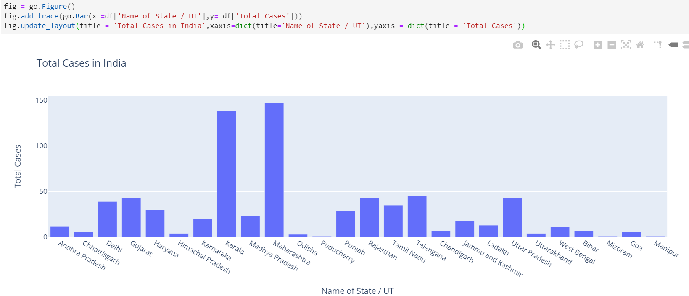

# Cheat Sheet
#### Her bir kolonu en büyük değerlerini kolayca incelemek için

####  Grupladıktan sonra toplamlara göre büyükten küçüğe sıralama

#### Görüntünün daha iyi olması için sona to_frame() ekleyip dataframe olarak daha iyi görebiliriz.

#### Plotların figure boyutlarını bir defa verip devamlı olarak tekrar yazmamak için aşağıdaki komutu girmek yeterlidir.

#### Plotly da aynı pandas dataframe görselleştirilir gibi görselleştirilir sadece başına **i** eki gelir

#### Plotly express ile de efektif plotlar uluşturulabilir

#### Kolon ismini Değiştirme

